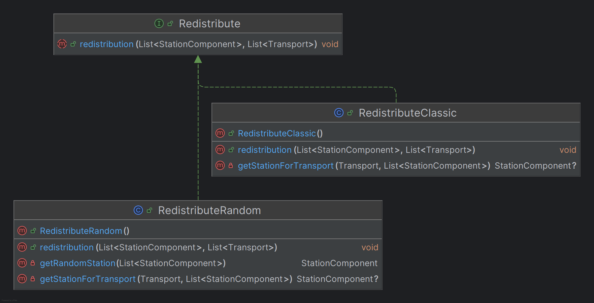
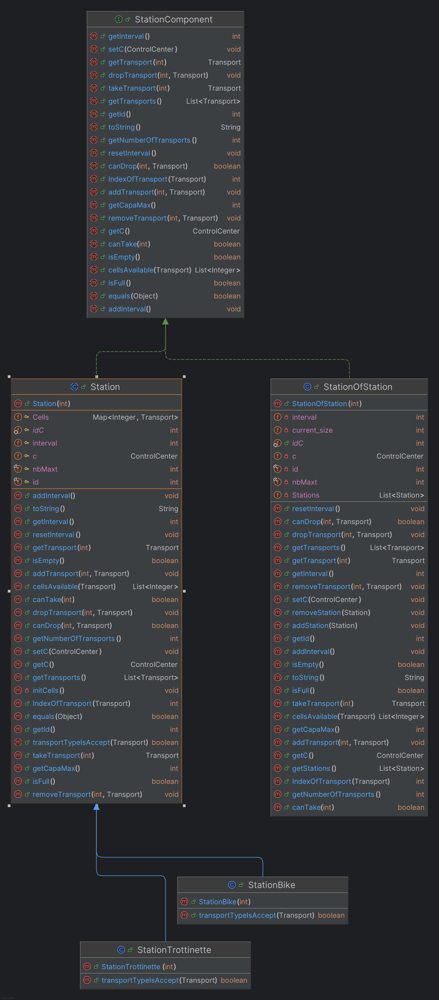
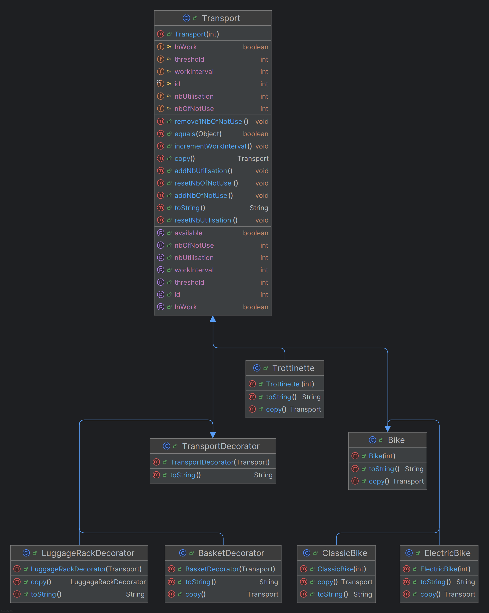
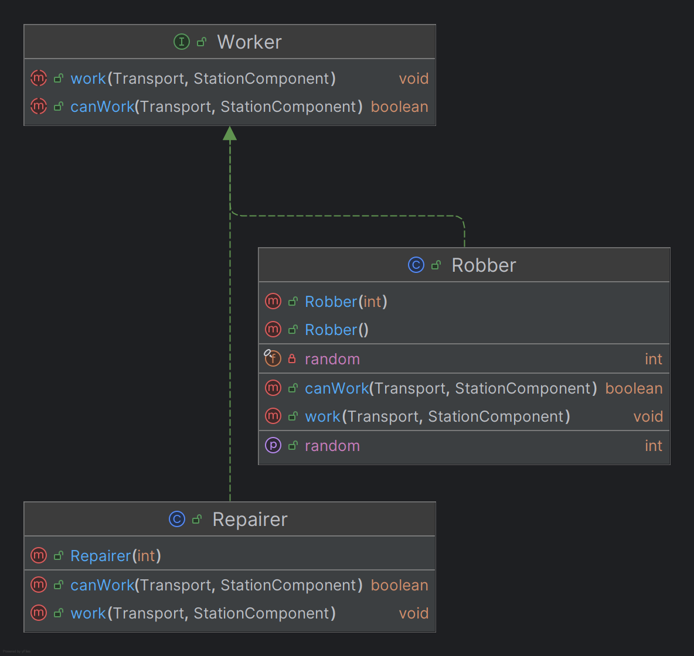
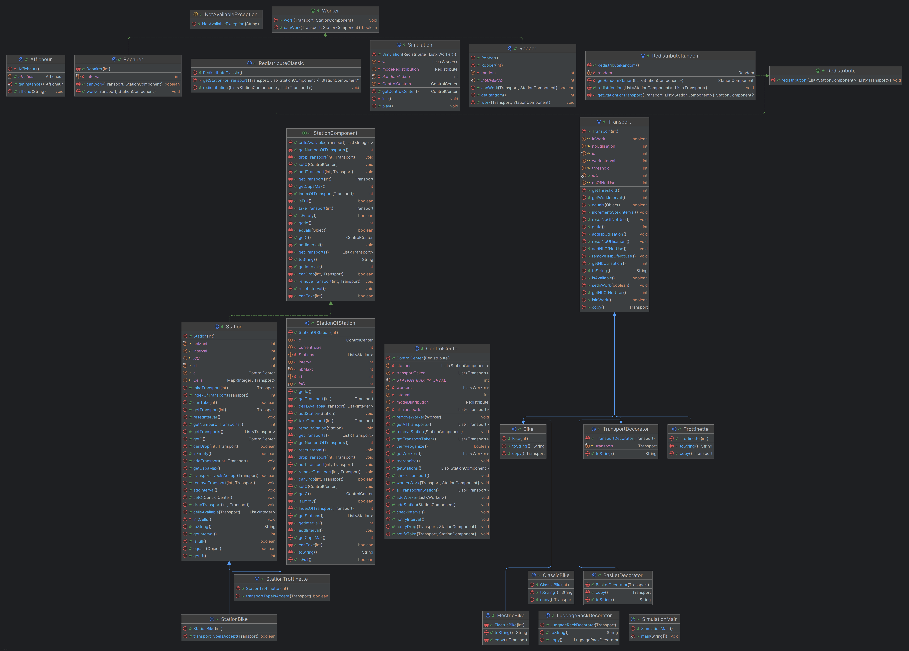

# Kreutser Gabriel - Lucas Sauvage 

## Présentation du projet. 

Ce dépôt correspond au projet COO de L3 Informatique de Gabriel Kreutser et Lucas Sauvage. 

Il s'agit d'implémenter un système de location de transports en libre service. 

### Pré-requis
- **Java** : Version 11
- **Maven** : Version 3.8.1
- **JUnit 5** : Inclus via Maven

## HowTo

- Source :
```bash 
git clone git@gitlab-etu.fil.univ-lille.fr:gabriel.kreutser.etu/kreutser-sauvage-coo.git
cd kreutser-sauvage-coo
```
- Documentation :
```bash 
make doc
```
- Compilation Source :
```bash 
make compile
```
- Execution Source :
```bash 
make main
```
- Compilation Tests :
```bash 
make compile_test
```
- Execution Tests :
```bash 
make test
```
- Génération Jar :
```bash 
make jar
```
- Execution Jar :
```bash 
make run_jar
```
- Site avec le coverage (utilise Firefox) :
```bash 
make coverage
```

## Présentation du code

### Conception 

<!-- Objets Afficheur -->
[Afficheur]:./vlille/src/main/java/afficheur/Afficheur.java
<!-- Objets ControlCenter -->
[ControlCenter]:./vlille/src/main/java/controlCenter/ControlCenter.java
<!-- Objets Redistribute -->
[Redistribute]:./vlille/src/main/java/redistribute/Redistribute.java
[RedistributeClassic]:./vlille/src/main/java/redistribute/RedistributeClassic.java
[RedistributeRandom]:./vlille/src/main/java/redistribute/RedistributeRandom.java
<!-- Objets Simulation -->
[Simulation]:./vlille/src/main/java/simulation/Simulation.java
<!-- Objets Station -->
[Station]:./vlille/src/main/java/station/Station.java
[StationBike]:./vlille/src/main/java/station/StationBike.java
[StationComponent]:./vlille/src/main/java/station/StationComponent.java
[StationOfStation]:./vlille/src/main/java/station/StationOfStation.java
[StationTrottinette]:./vlille/src/main/java/station/StationTrottinette.java
<!-- Objets Transport -->
[Transport]:./vlille/src/main/java/transport/Transport.java
[Bike]:./vlille/src/main/java/transport/bike/Bike.java
[Trottinette]:./vlille/src/main/java/transport/trottinette/Trottinette.java
[ClassicBike]:./vlille/src/main/java/transport/bike/ClassicBike.java
[ElectricBike]:./vlille/src/main/java/transport/bike/ElectricBike.java
[TransportDecorator]:./vlille/src/main/java/transport/decorator/TransportDecorator.java
[BasketDecorator]:./vlille/src/main/java/transport/decorator/BasketDecorator.java
[LuggageRackDecorator]:./vlille/src/main/java/transport/decorator/LuggageRackDecorator.java
<!-- Objets Util -->
[NotAvailableException]:./vlille/src/main/java/util/exception/NotAvailableException.java
<!-- Objets Worker -->
[Repairer]:./vlille/src/main/java/worker/Repairer.java
[Robber]:./vlille/src/main/java/worker/Robber.java
[Worker]:./vlille/src/main/java/worker/Worker.java


#### L'objet Afficheur 

L'objet [**Afficheur**][Afficheur] existe pour nous permettre d'afficher (et oui!). Nous l'utilisons pour évité de gérer tout les prints dans les classes de base. 

Il s'agit d'un **singleton** : L'attribut est static, ce qui nous permet d'être sûr qu'il n'en existe qu'un et il est déclaré globalement, afin de ne pas recreer d'instance à chaque fois. 

L'objet est créé grâce à la méthode *getInstance()*, qui appelle elle-même le constructeur [**Afficheur**][Afficheur] (qui est en private pour garantir que l'objet soit unique). 

#### L'objet ControlCenter

L'objet [**ControlCenter**][ControlCenter] permet de contrôler les différentes stations (voir Station). La liste des employés (Worker) étant commune à toutes les stations (d'un même **ControlCenter**), ils sont égalements gérés par le **ControlCenter**. 

Les attributs de l'objet **ControlCenter** sont : 

    (static final int) STATION_MAX_INTERVAL = 2 : Le nombre d'intervalle des stations. S'il est supérieur à deux la station est réinitialisée.

    (List<Transport>) transportTake : Correpond à la liste des transports empruntés 
    (List<Station>) stations : La liste des stations gérées par le ControlCenter
    (List<Transport>) allTransports : La liste de tous les transports gérés par le ControlCenter
    (List<Worker>) workers : La liste de tous les employés gérés par le ControlCenter 
    (Redistribute) modeDistribution : Mode de distribution du ControlCenter

Le **ControlCenter** est un **observateur**, qui permet d'observer et notifier et donc d'agir en conséquences. Il implémente les fonctions *notifyDrop()*,*notifyTake()* et *notifyInterval()*, qui sont utilisées par les **Stations**. 
Le **ControlCenter** est aussi capable de regarder à chaque intervalle si la **Station** est vide ou pleine, afin de la réorganiser, grâce aux fonctions *checkInterval()* et *checkTransport()*. Le **ControlCenter** peut ensuite réorganiser les **Stations** grâce à la fonction *reorganize()*(qui utilise une **stratégie**), qui est appelé par *notifyInterval()*. 
Il va également gérer les **Worker** tels que les voleurs qui vont aléatoirement volé un vélo ou non si les conditions sont respecter, ou bien les réparateur vont pouvoir réparer les vélos, s'il y a des vélos qui ne sont cassés (grâce à une interface qui implemente les actions possibles des workers). 


#### Les objets Redistribute 

Les objets Redistribute sont des **stratégies**. La première, [**Redistribuite**][Redistribute], est une interface permettant l'implémentation des stratégies :  [**RedistributeClassic**][RedistributeClassic] ou [**RedistributeRandom**][RedistributeRandom] .   
- [**RedistributeClassic**][RedistributeClassic] va prendre tous les transports des stations et si le transport est *available* on le sort de sa station. On le déplace dans une autre station suivant un index qui va évoluer celon le nombre de station,  afin d'équilibrer le nombre de vélo par station.
- [**RedistributeRandom**][RedistributeRandom] va plus ou moins s'exécuter de la même façon que **RedistributeClassic**, à  la seull différence que pour lui, la station sera trouver aléatoirement.


#### Les objets Station 

La première classe est une interface : [**StationComponent**][StationComponent] qui permet d'implémenter un **composite**, En se sens l'interface implémente les comportements par défaut des autres objets stations.   
[**Station**][Station] correspond à une seule station. C'est la classe mère de [**StationBike**][StationBike] et [**StationTrottinette**][StationTrottinette] qui héritent de **Station**. La classe abstraite **Station** déclare les attributs suivants : 

    (ControlCenter) c : L'objet ControlCenter (Observateur) 
    (final int) nbMaxt : Le nombre maximum de transport de la station.        (Map<Integer,Transport>) Cells : La map qui nous permet de ranger les transports dans un tableau indexé.
    (final int) id : L'identifiant de la station.
    (static int) idC : Le compteur global qui permet d'identifer individuellement les stations. 
    (int) interval : L'intervalle.

La **Station** implémente toutes les fonctions nécessaires pour géré les entrer et sortie de transport au sein meme de la sa structure.  
Pour se faire elle va utiliser :
- **TakeTransport** : Pour prendre un transport dans la station en notifiant le **ControlCenter**.
- **DropTransport** : Pour déposer un transport dans la station en notifiant le **ControlCenter**.

Mais la classe **Station** a actuellement deux sous-classes :  
- **StationBike**, qui permet de gérer uniquement les objets d'instance **Bike** grâce à la méthode **transportTypeIsAccept**, utilisée dans **canDrop** ou **canTake**, pour déterminer si la station est adaptée au type de transport.  
- **StationTrottinette**, qui permet de gérer uniquement les objets d'instance **Trottinette**, en utilisant la même méthode que **StationBike**.  

Nous avons créé ces deux classes pour différencier ces deux types de transport. Mais grâce à cette structure, nous sommes également ouverts à la création d'autres types de transport à l'avenir.

[**StationOfStation**][StationOfStation] permet de regrouper toutes les stations ayant un unique type de transport et de les gérer. Les attributs diffèrent de ceux de la classe **Station**. Ils sont :  

    (int) current_size : la somme des tailles des stations gérées par StationOfStation. (ne dépassant pas la taille maximal donné à la création)
    (List<Station>) Stations : La liste des stations 
    (ControlCenter) c : L'objet ControlCenter (Observateur) 
    (final int) nbMaxt : Le nombre maximum de transport de la station. 
    (final int) id : L'identifiant de la station.
    (static int) idC : Le compteur global qui permet d'identifer individuellement les stations. 
    (int) interval : L'intervalle.  

**StationOfStation** utilise les mêmes méthodes que **Station**, à la seule différence qu'elles s'appliquent à toutes les stations de sa liste. Cela permet de l'utiliser comme une station classique, évitant ainsi les difficultés lorsque nous souhaitons avoir une station accueillant à la fois des **Bikes** et des **Trottinettes**.


#### Les objets Transport 

La classe **mère** de tous les objets de type Transport, tel que l'objet Bike ou bien Trottinette est la classe abstraite [**Transport**][Transport].

Nous avons créé une classe abstraite car tous les moyens de transports partagent les mêmes attributs de base, tels que : 

    (int) treshold : Nombre d'utilisation maximal du transport
    (final int) id : L'identifiant du transport 
    (static int) idC : Le compteur global qui permet d'identifer individuellement les transports
    (int) nbUtilisation : Nombre d'utilisation actuel du transport
    (int) nbOfNotUse : Nombre de boucles où le transport n'est pas utilisé 
    (boolean) inWork : True si le transport est "en travail", False sinon 
    (int) workInterval : Nombre de boucles où le transport doit rester "en travail"

Dans [**Transport**][Transport], nous gérons toutes les données relatives aux moyens de transport, de leur durée de vie à leur réparation.  
Nous avons décidé de ne pas introduire de **State** pour gérer les états des transports, car nous utilisons un unique booléen permettant d'incrémenter ou non le compteur de l'intervalle d'état *work*.  

Suite à la création de la classe mère, nous avons ajouté deux classes filles héritant directement de [**Transport**][Transport] :  

- [Bike.java][Bike]  
- [Trottinette.java][Trottinette]  

Chacune de ces classes définit un type de transport spécifique (le nom est explicite).  

La classe [**Trottinette**][Trottinette] est actuellement une simple classe fille, car il n'existe qu'un seul type de trottinette dans notre implémentation. Cependant, notre modélisation actuelle ne nous empêche pas de créer un nouveau type de trottinette et de l'implémenter facilement dans le code.  

La classe [**Bike**][Bike], en revanche, est la classe mère de deux types de vélos : les vélos électriques et les vélos classiques. Cette classe est également utile pour la création de nouveaux types de vélos.  

Les [**ClassicBike**][ClassicBike] représentent les vélos classiques. La seule différence avec les [**ElectricBike**][ElectricBike], qui sont les vélos électriques, réside dans la fonction *toString()* (pour le moment).


De plus, nous avons des accessoires qui peuvent être appliqués à tous les types de transport : 
- Pour l'instant nous avons accès à des transports avec paniers et des transports avec portes-bagages. Pour se faire, nous avons utilisé un **Décorateur**.

La classe mère est la classe [**TransportDecorator**][TransportDecorator] qui hérite de la classe [**Transport**][Transport]. Les classes "decorator" va mimer le comportement d'un objet **Transport**. 

Après avoir créé un objet de type **TransportDecorator**, on fait appel à deux classes filles de [**TransportDecorator**][TransportDecorator] : 
 - La classe [**BasketDecorator**][BasketDecorator] qui créé un objet **TransportDecorator** avec un panier
 - La classe [**LuggageRackDecorator**][LuggageRackDecorator] qui créé un objet **TransportDecorator** avec un porte-bagages.  
 
Ne changeant pour le moment que le *toString()*.

         
#### Les objets Util 

Dans le package Util nous avons défini une exception : [**NotAvailableException**][NotAvailableException] qui est utilisée dans les fonctions qui demandent d'avoir accès à un transport. Tels que *TakeTransport(int i,Transport t )* dans la classe **Station** .

#### Les objets Worker

L'interface [**Worker**][Worker] régit les comportements des employés.  

Les objets **Worker** correspondent aux différentes personnes nécessaires à la simulation :  

- **Les employés ([**Repairer**][Repairer])** :  
  Ils sont chargés de réparer les transports. Chaque **Repairer** répare un transport selon l'intervalle de temps donné en paramètre lors de sa création (dans la simulation, nous utilisons la valeur 3).  
  Le **Repairer** possède la méthode *canWork()* définie dans l'interface, qui permet de vérifier s'il peut travailler. Par exemple, cette méthode est utilisée dans le **ControlCenter** pour déterminer si un réparateur doit être envoyé pour réparer un vélo cassé.  
  Dans notre implémentation, le **Repairer** est considéré comme une fonctionnalité du **ControlCenter**. Même si un seul objet est instancié, il représente une équipe d'employés. Cela signifie que plusieurs transports peuvent être en réparation simultanément.  

- **Les voleurs ([**Robber**][Robber])** :  
  Les voleurs volent aléatoirement des transports si les conditions nécessaires sont remplies. Un transport peut être volé s'il reste seul dans une station pendant plus de deux intervalles de temps (deux boucles dans notre simulation).  
  Cette condition est définie dans la méthode *canWork()* de la classe **Robber**. Si les conditions sont remplies, la méthode *work(Transport t, StationComponent s)*, issue de l'interface [**Worker**][Worker], est utilisée pour voler un vélo sans en informer le **ControlCenter**.  

Dans notre modélisation des **Worker**, il est facile d'ajouter de nouveaux types d'employés si nécessaire. Il suffit de créer une nouvelle classe qui implémente **Worker** et de l'ajouter à la liste des workers du **ControlCenter** (étant fait apres la création du ControlCenter, nous avons donc pas besoin de modifier cette classe pour y ajouter les nouveaux worker).


#### L'objet Simulation

[**Simulation**][Simulation], comme son nom l'indique, est une simulation permettant d'implémenter notre observateur, nos stations, ainsi que nos transports. La fonction *init()* initialise le **ControlCenter**, les différents transports,ansi que les stations.  

Dans notre cas, nous avons décidé de n'utiliser que des stations pouvant contenir à la fois des *vélos* **et** des *trottinettes*, puis nous avons ajouté des vélos ou/et des trottinette de façon random.  

Ensuite, la méthode *play()* exécute la simulation en réalisant des actions aléatoires. Les actions de la simulation consistent à prendre un transport ou non, le déposer ou non, faire intervenir les workers ou non , ect ...

La méthode *play()* repose sur une boucle *while* infinie (avec un *sleep(1000)* à chaque fin de boucle). Comme nous avons défini une liste fixe de transports lors de l'initialisation, le nombre de transports est limité. Cela signifie qu'au fil de la simulation, en raison des voleurs, il arrive un moment où les stations n'ont plus assez de transports pour fonctionner correctement.


### Test

Nous voulions garantir une grande qualité et robustesse de notre projet. En ce sens, nous avons mis en place un grand nombre de tests couvrant ainsi les principales fonctionnalités de notre code (nous avons un total de 212 méthodes de test.).  
Nous avons décidé de mettre en place de l'héritage de tests pour les classes **Transport** et **Station**, ce qui nous permet de vérifier le bon fonctionnement des classes filles tout en réutilisant les mêmes tests que la classe mère.  
Nous avons également utilisé certaines méthodes, telles que :   

    java.io.ByteArrayOutputStream outContent = new java.io.ByteArrayOutputStream();  
    System.setOut(new java.io.PrintStream(outContent));  
    assertTrue(outContent.toString().contains(s));

Pour nous permettre de tester les *systeme.out.println()* de notre code.
Grâce à ces différentes approches, nous avons pu atteindre 92% de lignes couvertes, 81% de mutation coverage, et 86 % de force de nos tests (pourcentages obtenus suite à l'exécution de la commande *make coverage*).  
Tout cela démontre l'efficacité de nos tests. Nous pouvons donc affirmer que cette stratégie de test contribue à assurer un fonctionnement fiable et conforme aux exigences.


### UML
